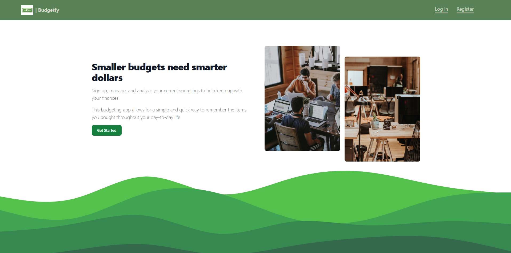
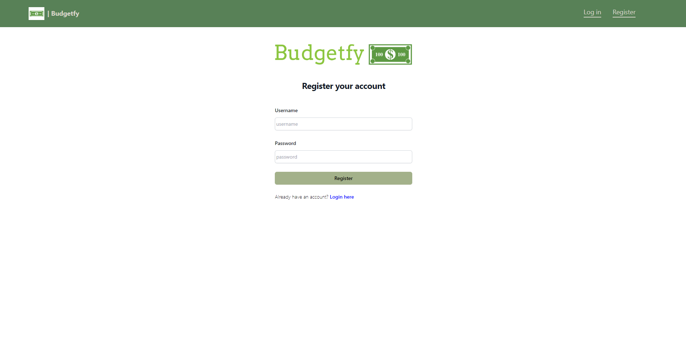
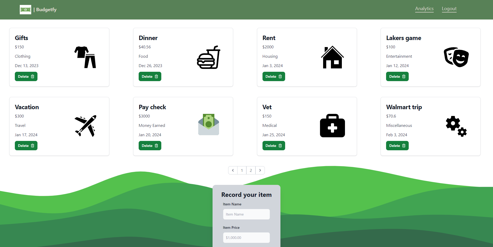
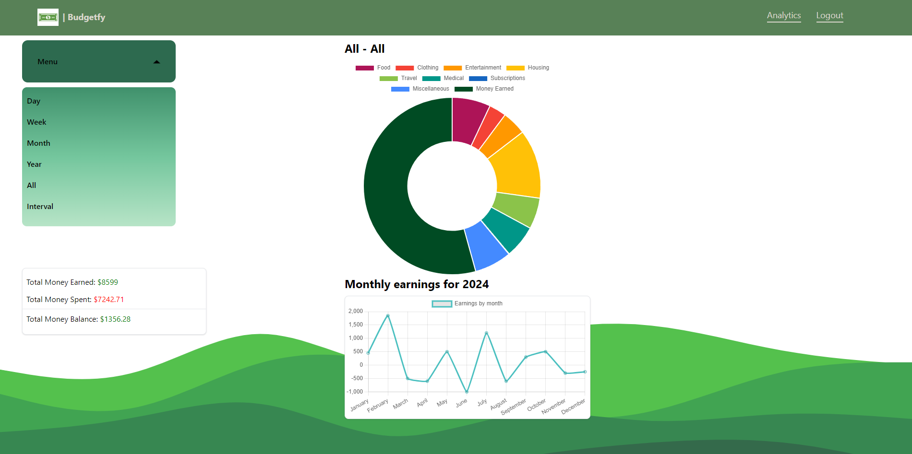
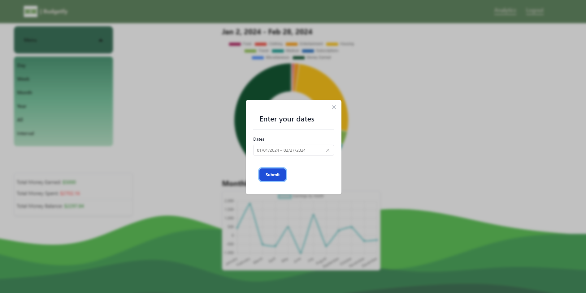

# Budgetfy

A budgeting app that allows for a simple and quick way to remember the items you bought throughout your day-to-day life. Keep track of your finances throughout the year and see what categories your spending habits lean towards.

## <a href="https://stevens-budgetfy.netlify.app/"> Deployed on Netlify </a>
_Frontend is hosted on a free Netlify server. Backend is hosted on Render._

## Docker Setup (alternative) ##

    Docker Hub Repository: https://hub.docker.com/repository/docker/stevennguyen22/budgetfy/general
    Have Docker installed 
    Copy the compose.yml file
    In terminal run: 
      docker pull stevennguyen22/budgetfy:frontend
      docker pull stevennguyen22/budgetfy:backend
      docker compose up

Home Page 
 

Register Page 
 

Items Page 
 

Analytics Page 
 

Date Range Modal 
 

## Tech-Stack

Below is a list of technologies used throughout the project.

<table>
      <thead>
        <tr>
          <th>Frontend</th>
          <th>Backend</th>
          <th>Technologies</th>
        </tr>
      </thead>
      <tbody>
            <tr>
              <td>React.js</td>
              <td>Express.js</td>
              <td>Docker</td>
            </tr>
            <tr>
              <td>Typescript</td>
              <td>Node.js</td>
              <td></td>
            </tr>
            <tr>
              <td>Tailwind CSS</td>
              <td>MongoDB</td>
              <td></td>
            </tr>
            <tr>
              <td>Framer-Motion</td>
              <td></td>
              <td></td>
            </tr>
            <tr>
              <td>Chart.js</td>
              <td></td>
              <td></td>
            </tr>
      </tbody>
  </table>
